# Microsoft Sentinel Azure Setup

## _Create App Registration & Add Related User Options_
**1**. Navigate to `App Registrations`
    

      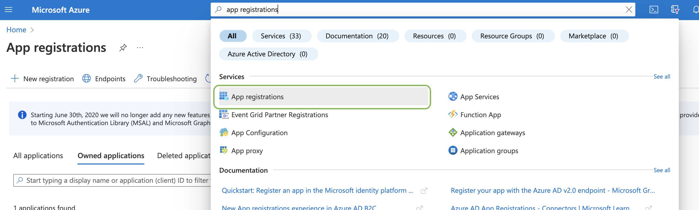
    

**2**. Select `New registration`
    

      
    

**3**. Add a memorable name for the new registration then click `Register`
    

      
    

**4**. Navigate to your newly created app registration, then copy the `Application (client) ID` & `Directory (tenant) ID` to the relevant Polarity User Options
    

      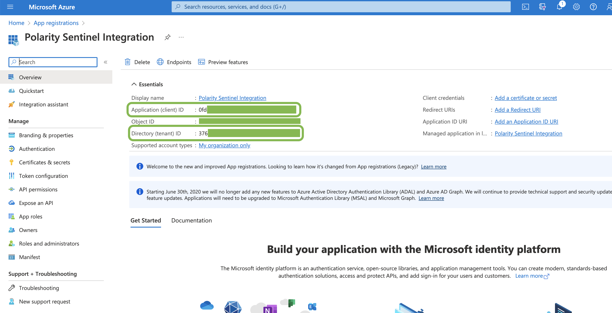
      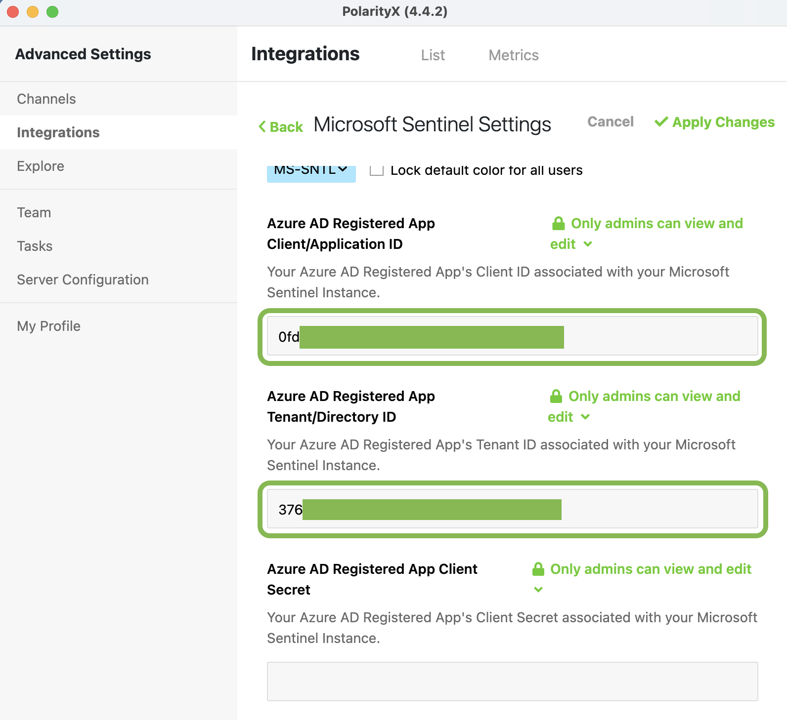
    

**5**. Click the `Add certificate or secret` link
    

      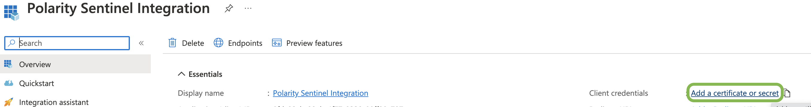
    

**6**. Click `New client secret` 
    

      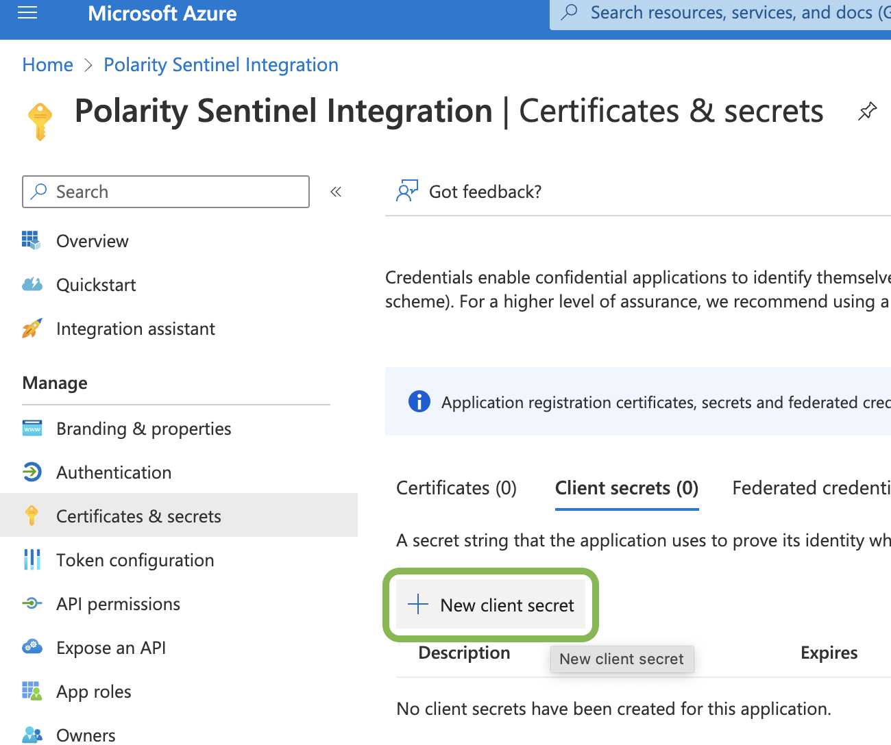
    

**7**. Add your desired secret key description then click `Add`
    

      
    

**8**. Copy your new client secret `Value` (_Not ID_) to to the relevant Polarity User Option
    

      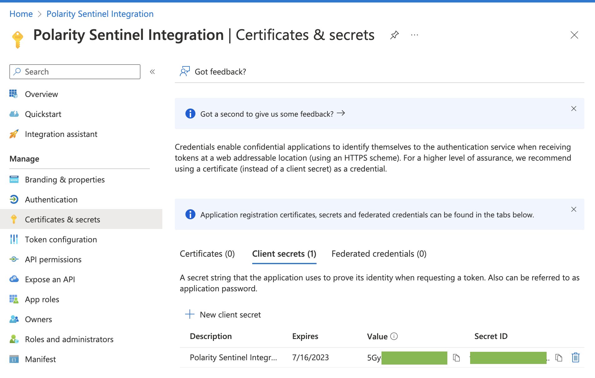
      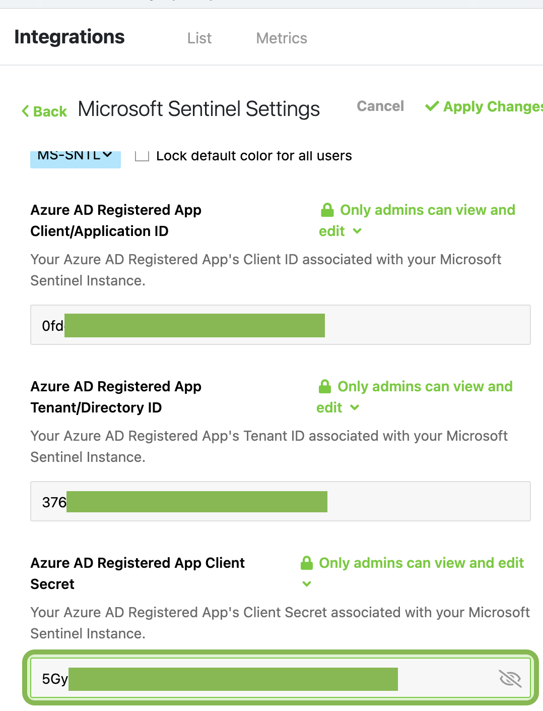
    

## _Get Subscription & Resource User Options_
**9**. Navigate to `Log Analytics workspaces`
    

      
    

**10**. Select the `Resource Group` associated with your Sentinel Log Analytics workspace
    

      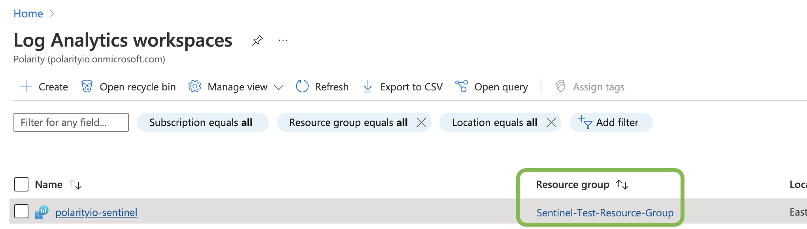
    

**11**. Copy the `Subscription ID` & `Resource group name` to the relevant Polarity User Option
    

      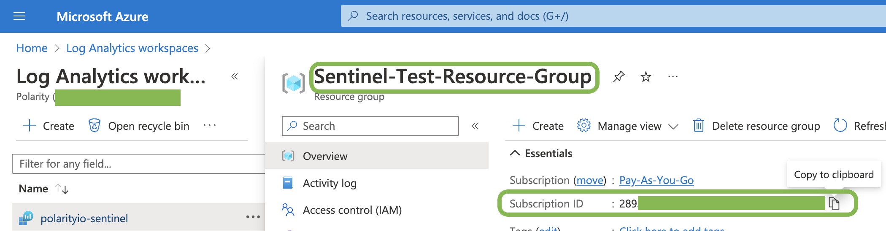
      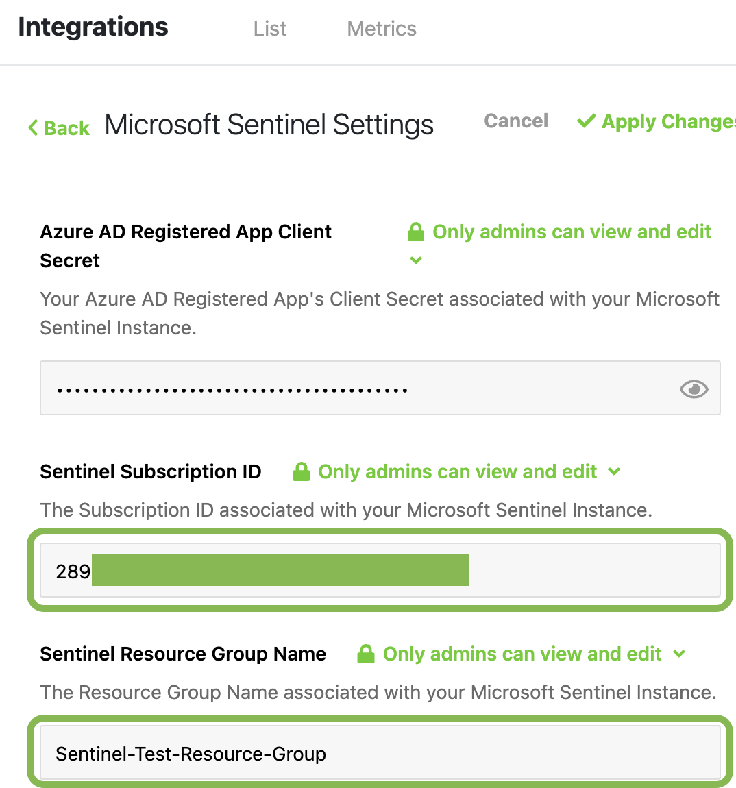
    

## _Setup IAM Role for App Registration_
**12**. Navigate to `Access control (IAM)`
    

      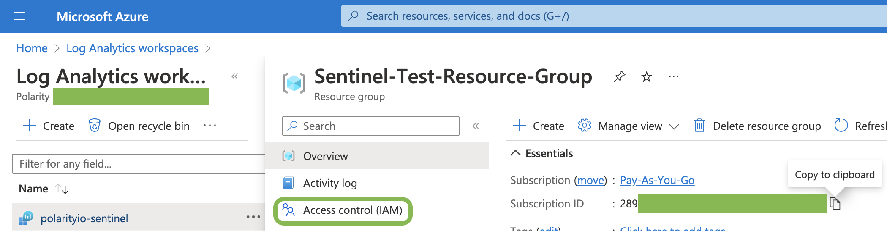
    

**13**. Click `Add` then click `Add role assignment`
    

      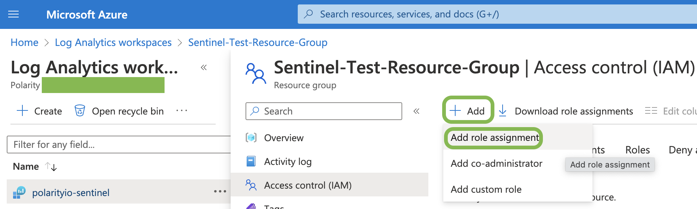
    

**14**. Search for `Log Analytics Reader` and make sure to Click the table row for it before clicking `Next`
    

      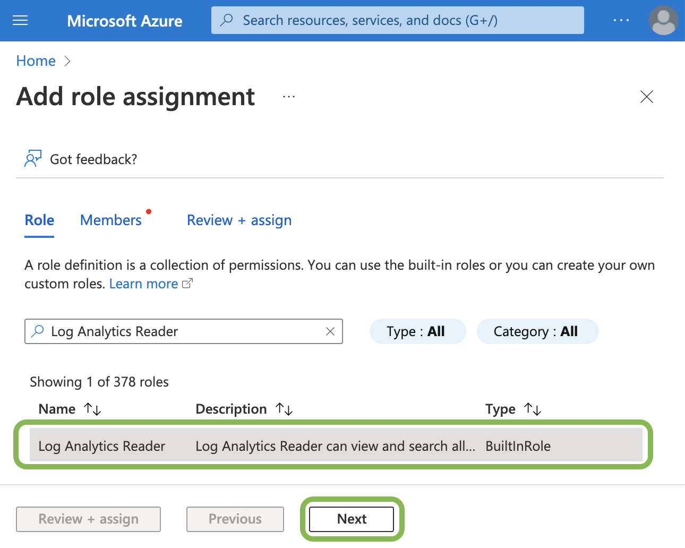
    

**15**. Click `Select members +` then Search for your _App Registrations Name_ and Click the App Registrations Name
    

      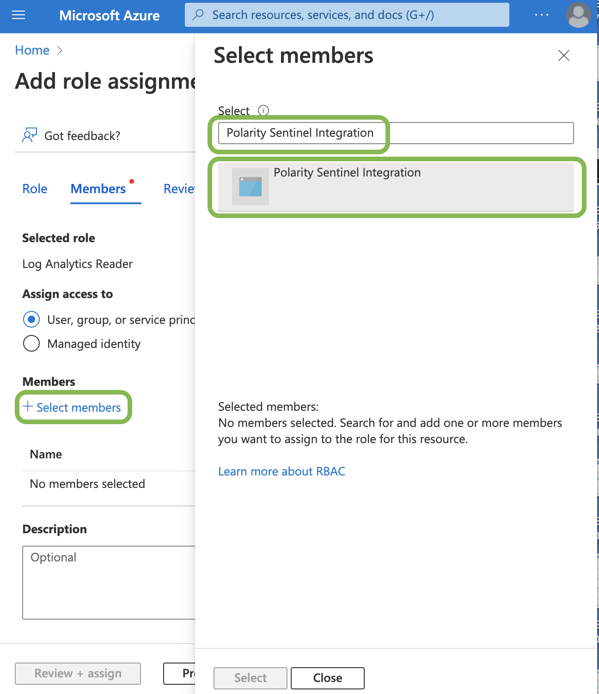
    

**16**. Click `Select` then Click `Review + assign` 2 times
    

      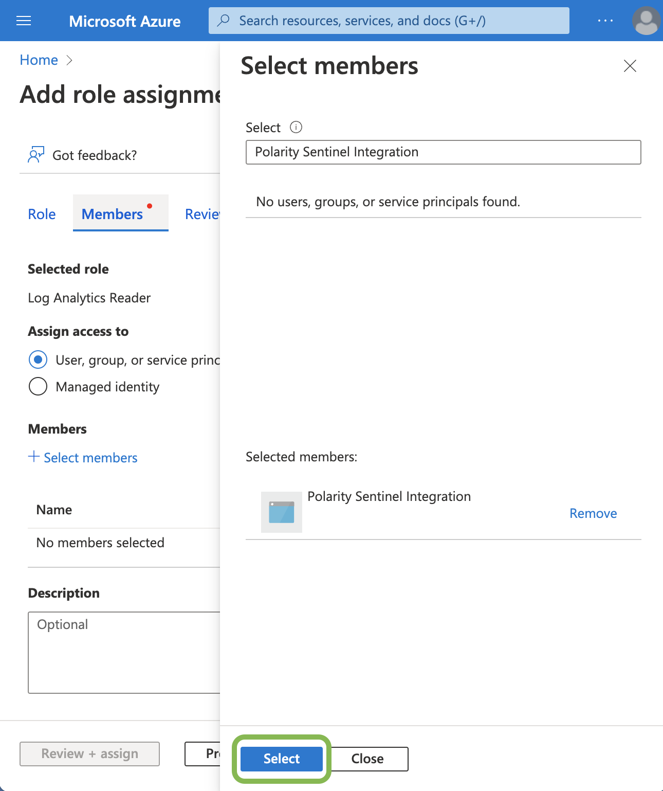
      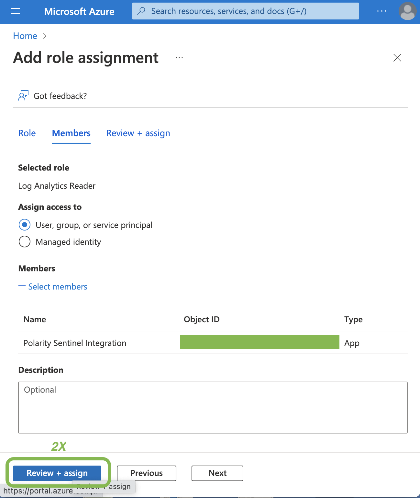
    

**17**. Navigate back to the `Log Analytics workspaces` (Step 9) and Select your Sentinel Log Analytics Workspace, then Copy the `Workspace Name` & `Workspace ID` to the relevant Polarity User Options 
    

      
      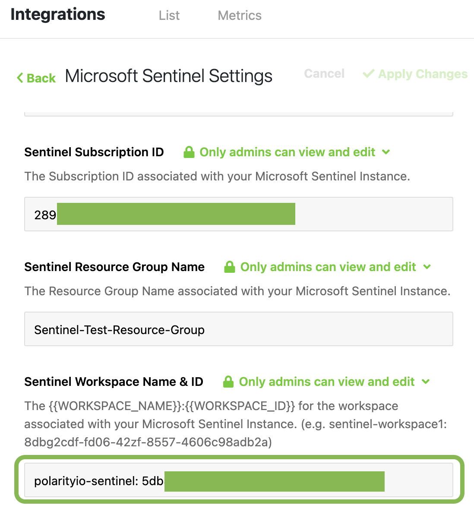
    

## Apply Changes
**18**. Make sure to Click `Apply Changes` for your Polarity User Options
