# Polarity Microsoft Sentinel Integration

Microsoft Sentinel puts the cloud and large-scale intelligence from decades of Microsoft security experience to work.

The Polarity Microsoft Sentinel Integration allows users to search for WHOIS, Geolocation
Data, Incidents, Threat Intelligence Indicators, and Query Logs via Kusto Queries for Domains, IP Addresses, and Hashes.

> **_NOTE:_** You can find instructions on how to setup your _Azure instance of Microsoft Sentinel_ in [MicrosoftSentinelAzureSetup.md](./MicrosoftSentinelAzureSetup.md)

  

To learn more about Microsoft Sentinel, visit the [official website](https://azure.microsoft.com/en-us/products/microsoft-sentinel/).

## Microsoft Sentinel Integration Options

### Azure AD Registered App Client/Application ID

Your Azure AD Registered App's Client ID associated with your Microsoft Sentinel Instance.

### Azure AD Registered App Tenant/Directory ID

Your Azure AD Registered App's Tenant ID associated with your Microsoft Sentinel Instance.

### Azure AD Registered App Client Secret Value

Your Azure AD Registered App's Client Secret Value associated with your Microsoft Sentinel Instance.

### Sentinel Subscription ID',

The Subscription ID associated with your Microsoft Sentinel Instance.

### Sentinel Resource Group Name

The Resource Group Name associated with your Microsoft Sentinel Instance.

### Sentinel Workspace Name & ID

The {{WORKSPACE_NAME}}:{{WORKSPACE_ID}} for the workspace associated with your Microsoft Sentinel Instance.
(e.g. sentinel-workspace1: 8dbg2cdf-fd06-42zf-8557-4606c98adb2a)

### Kusto Query String

Kusto Query String to execute on the Sentinel Log Analytics Workspace.
The string `{{ENTITY}}` will be replace by the looked up Entity.
For example: ThreatIntelligenceIndicator | search "{{ENTITY}}" | take 10

### Kusto Query Summary Fields

Comma delimited list of field values to include as part of the summary.  
These fields must be returned by your Kusto Query to appear in the Summary Tags.
This option must be set to "User can view and edit" or "User can view only"

### Kusto Query Ignore Fields

Comma delimited list of Fields to ignore from the Kusto Query Results in the Overlay.
This option must be set to "User can view and edit" or "User can view only".

### Lookback Days

The number of days to look back when querying logs, and incidents.

### Ignore Geodata/WHOIS Only Results

If checked, entities will not return if only Geodata and/or WHOIS data is found, and no other query types have results.

### Enable Threat Intelligence Searches

If enabled, the integration will search threat intelligence indicator data.

## Microsoft Sentinel Azure Setup

**1**. Navigate to App Registrations

  

**2**. Select `New registration`
    

      
    

**3**. Add a memorable name for the new registration then click `Register`
    

      
    

**4**. Navigate to your newly created app registration, then copy the `Application (client) ID` & `Directory (tenant) ID` to the relevant Polarity User Options
    

      
      
    

**5**. Click the `Add certificate or secret` link
    

      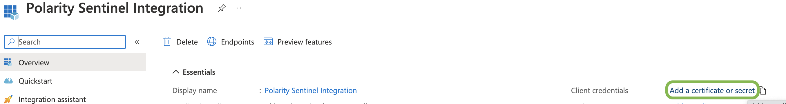
    

**6**. Click `New client secret` 
    

      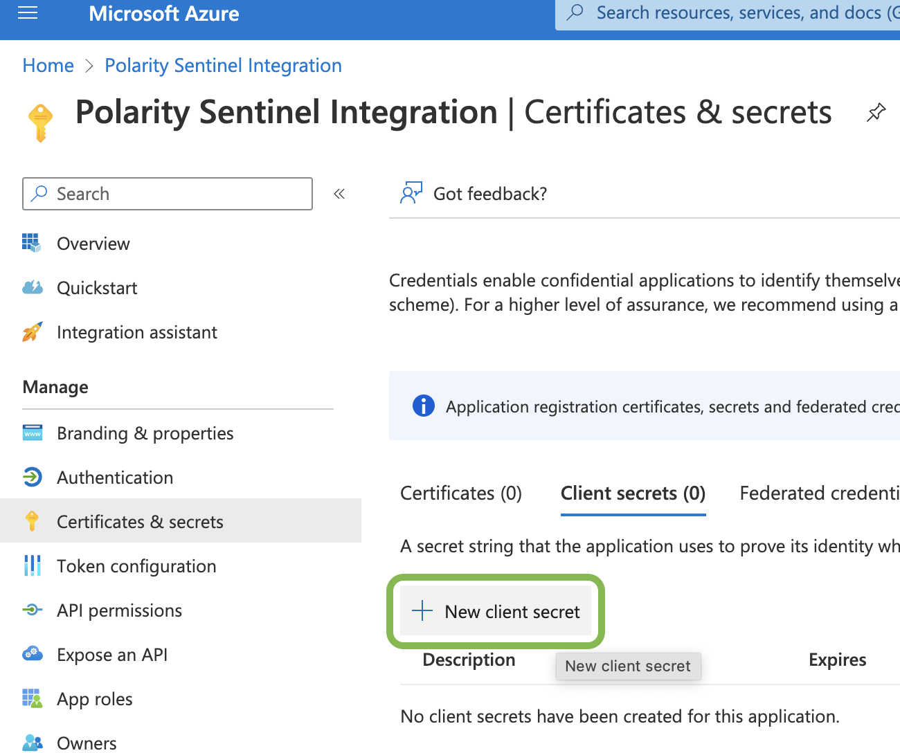
    

**7**. Add your desired secret key description then click `Add`
    

      
    

**8**. Copy your new client secret `Value` (_Not ID_) to the relevant Polarity User Option
    

      
      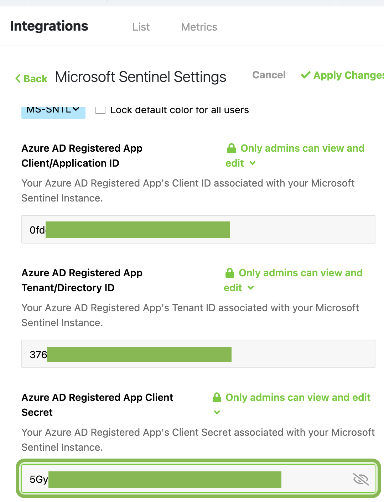
    

## _Get Subscription & Resource User Options_
**9**. Navigate to `Log Analytics workspaces`
    

      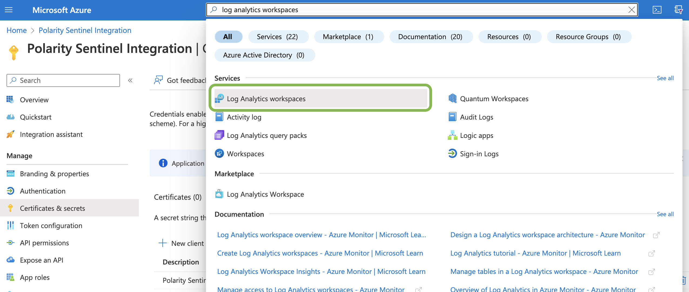
    

**10**. Select the `Resource Group` associated with your Sentinel Log Analytics workspace
    

      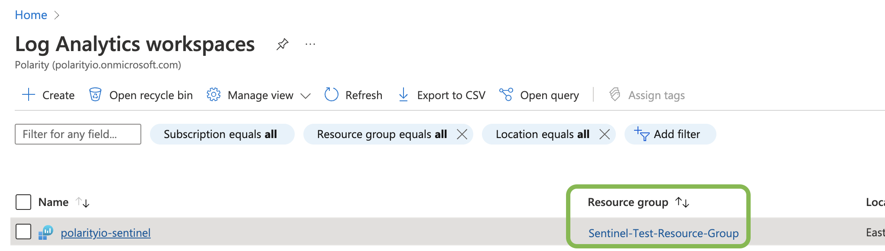
    

**11**. Copy the `Subscription ID` & `Resource group` name to the relevant Polarity User Option
    

      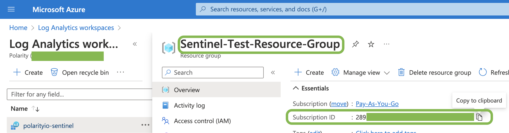
      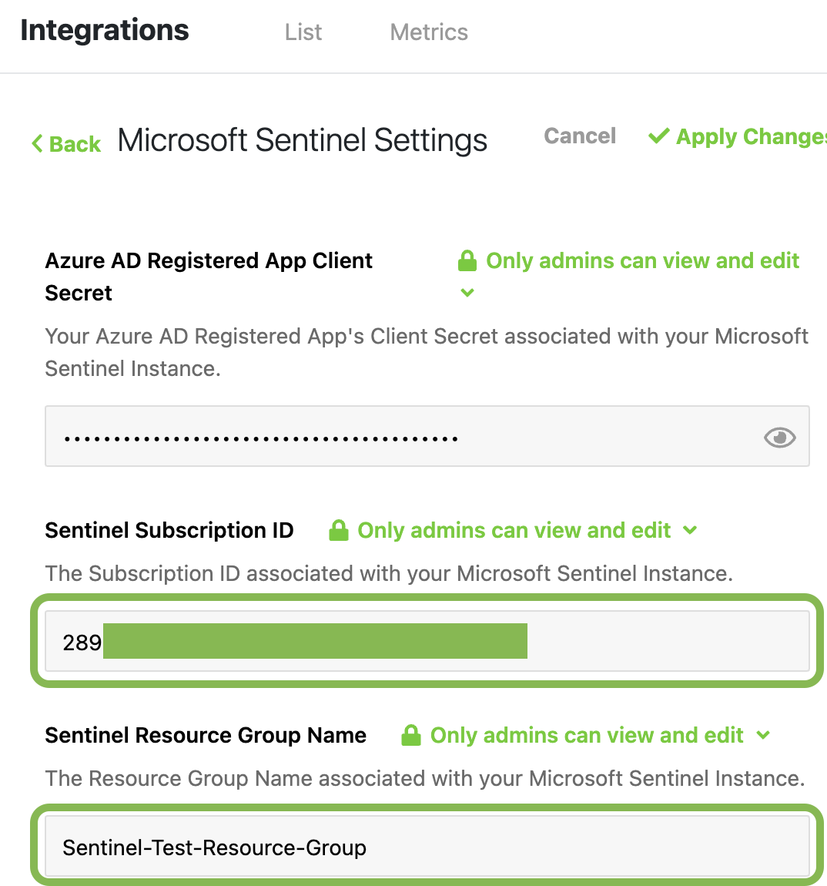
    

## _Setup IAM Role for App Registration_
**12**. Navigate to `Access control (IAM)`
    

      
    

**13**. Click `Add` then click `Add role assignment`
    

      
    

**14**. Search for `Log Analytics Reader` and make sure to Click the table row for it before clicking `Next`
    

      
    

**15**. Click `Select members +` then Search for your _App Registrations Name_ and Click the App Registrations Name
    

      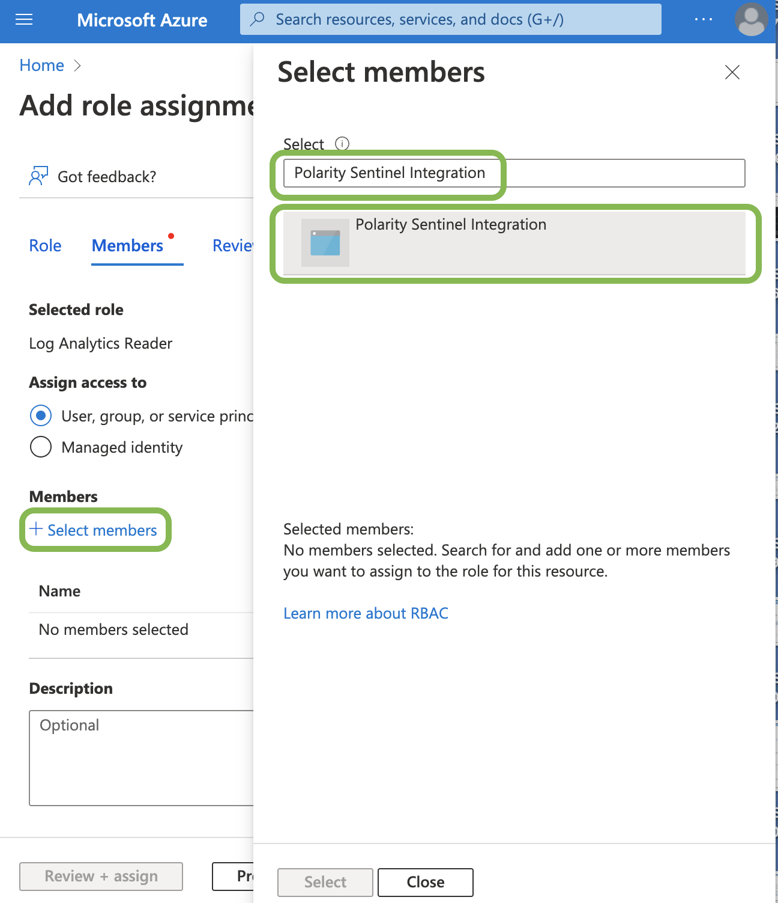
    

**16**. Click `Select` then Click `Review + assign` 2 times
    

      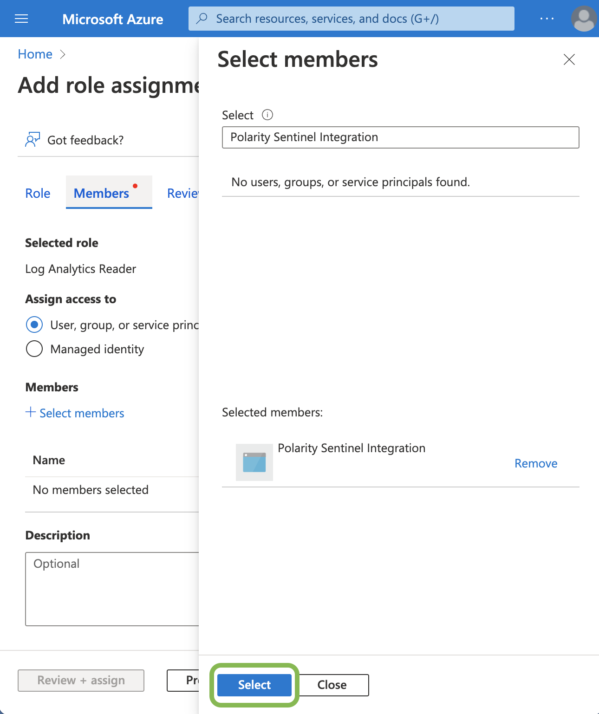
      
    

**17**. Navigate back to the `Log Analytics workspaces` (Step 9) and Select your Sentinel Log Analytics Workspace, then Copy the `Workspace Name` & `Workspace ID` to the relevant Polarity User Options 
    

      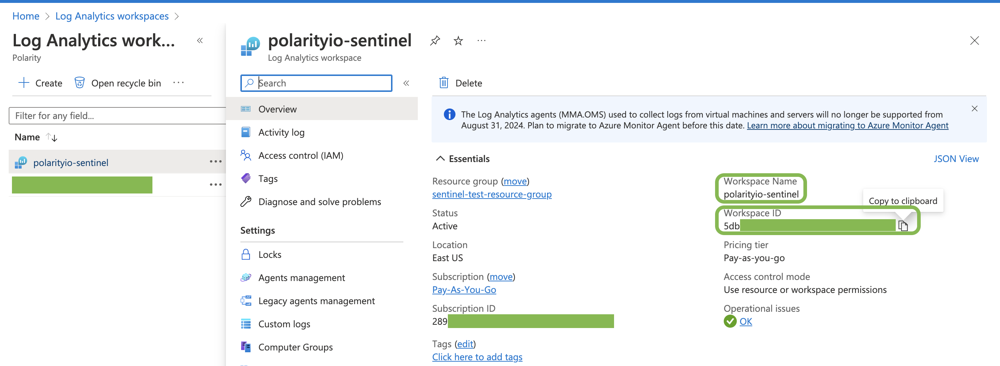
      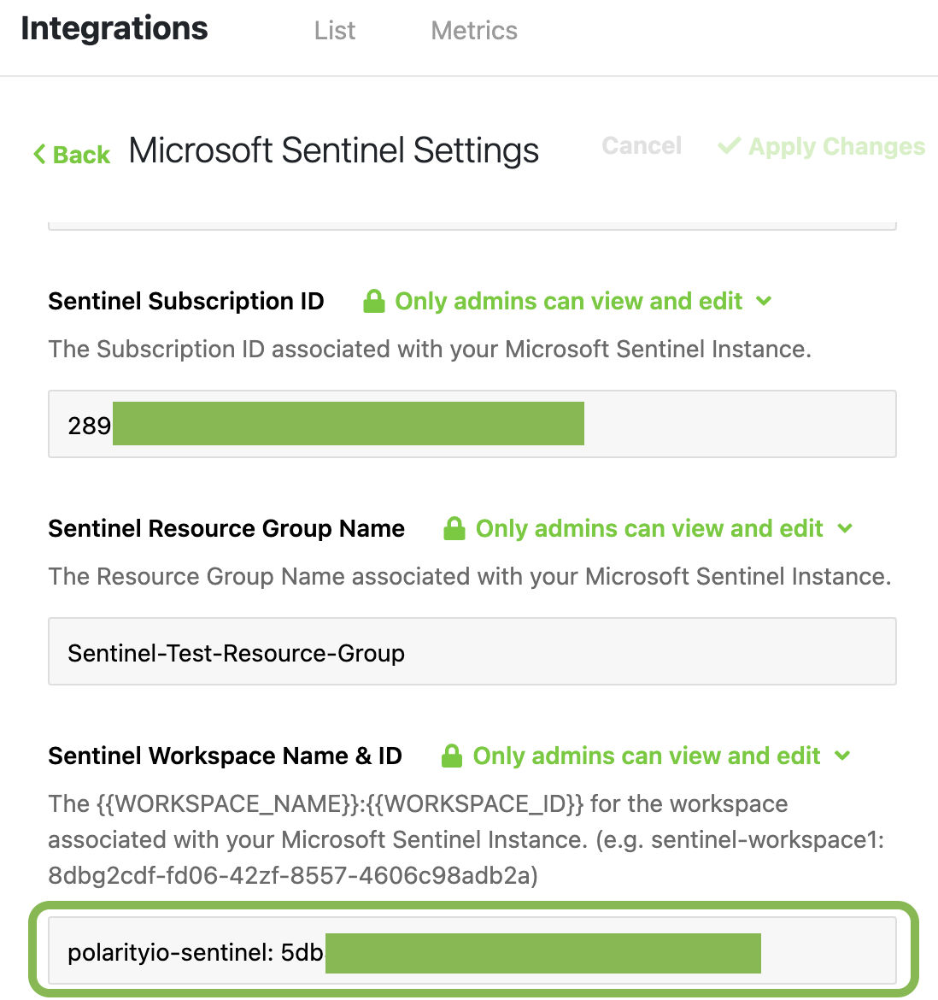
    

## Apply Changes
**18**. Make sure to Click `Apply Changes` for your Polarity User Options

## Installation Instructions

Installation instructions for integrations are provided on the [PolarityIO GitHub Page](https://polarityio.github.io/).
## Polarity

Polarity is a memory-augmentation platform that improves and accelerates analyst decision making. For more information about the Polarity platform please see:

https://polarity.io/
